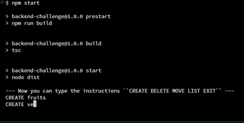
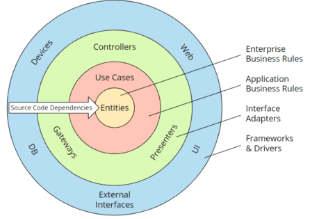
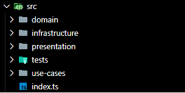
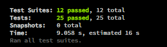

# Hierarchical directory organizer

## Content

* [Introduction](#introduction)
* [Tech stack used for the project](#tech-stack-used-for-the-project)
* [How to sync the project](#how-to-sync-the-project)
* [Skafolding](#skafolding)
* [Tests](#tests)

## Introduction

This project is made using as main tecnology NodeJS with strict typing using Typescript where it's going to read some some commands typed in the shell and it's going to make some actions either ``CREATE,DELETE,MOVE,LIST (It's case sensitive)`` a tree directory that is stored in memory. Also this one is using Clean Architecture with ``Hexagonal Architecture`` as main skafolding to handle all of the operations involved to keep this one high scalable and mainteinable; besides that most the files are already tested using jest with a high coverage ``93.62%``




## Tech stack used for the project

* NodeJS
* Typescript
* Jest

## How to sync the project and execute

1. First, it's needed to clone the project using : ```git clone ...```
2. Run command ``npm install`` to install all of the developer dependencies (typescript,jest)
3. Run command ``npm start`` to launch project
4. Now you can procced adding typing the commands you want ``CREATE DELETE LIST MOVE EXIT``
   Hint: The program is case sensitive and EXIT is to finish the program execution

## Skafolding

As it has been mentioned, the project is using ``Hexagonal Architecture``, we have the folder ``domain`` which it contains all of the business rules that are the core of the project, ``infrastructure`` that it's in charge to manage all of the operations to the data structure used,it can be changed to another one, ``use-cases`` is the folder to storage all of the actions needed to reach towards infrastructure, ``presentation`` that it has to be loaded to be the entry point of the program, and finally the ``tests`` folder which contains all of the test per each file.

### Ilustration


### Project skafolding


## Tests

1. Install all dependencies with ``npm install``
2. To check all of the test cases working just run the command ``npm run test``
3. To check all the coverage ``npm run test:coverage``



